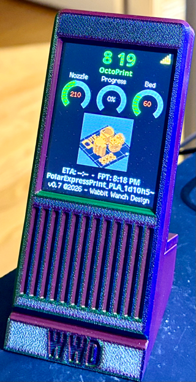
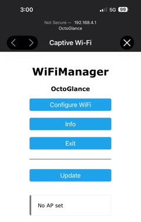
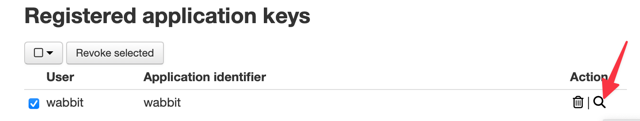
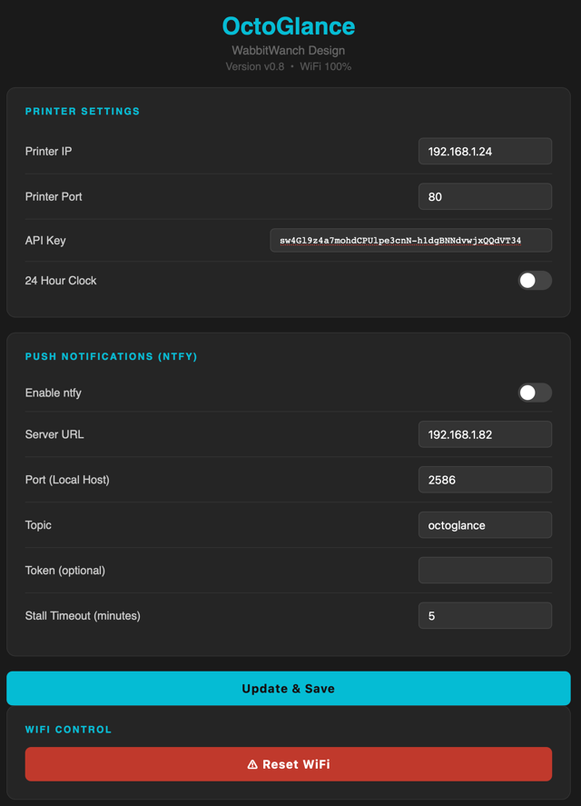

# OctoGlance v1.0
### An OctoPrint 3D Printer Monitor for the ESP32 CYD 2.8" (Cheap Yellow Display)

**Wabbit Wanch Design © 2026**



OctoGlance turns a budget ESP32 CYD into a dedicated 3D printer monitor for OctoPrint. It connects to OctoPrint over WiFi and displays real-time print status, temperatures, progress, ETA, and thumbnail previews.

---

## Features

- Real-time nozzle and bed temperatures
- Print progress gauge with ETA and Finish Print Time (FPT)
- Thumbnail preview fetched directly from OctoPrint (requires a thumbnail plugin — see [Printer Compatibility](#printer-compatibility))
- Print filename display
- Three-tier connection status — see [Connection Status](#connection-status)
- Pause detection — the progress arc turns orange and "Printer Paused" message shows
- Cancelled/failed print detection
- Push notifications via ntfy (print complete and stall/jam alerts)
- Automatic timezone detection via IP geolocation — no manual DST rules to configure
- Dark-themed web UI for configuration — no recompiling needed
- WiFi quality indicator
- NTP clock with 12/24 hour mode
- Seven language support in the codebase (English, French, German, Spanish, Dutch, Portuguese, Turkish) —  see [Language Settings](#language-settings)

---

## Hardware Required

- **ESP32 CYD 2.8"** (Cheap Yellow Display) — ESP32-2432S028R or compatible
- USB-C cable for flashing
- OctoPrint already setup and running

---

## Libraries Required

Install the following libraries via Arduino Library Manager:

- TFT_eSPI
- ArduinoJson
- WiFiManager
- TimeLib (Time by Michael Margolis)
- PNGdec
- LittleFS (included with ESP32 Arduino core)

---

## Quick Start

### 1. Flash the Firmware

1. Open the project in Arduino IDE 2.3.10
2. Select your board: **ESP32 Dev Module** NO OTA (2MB APP/2MB SPIFFS)
3. Set the language in `Language.h` (default is English — see [Language Settings](#language-settings))
4. Compile and upload to the CYD

### 2. Upload the Data Folder (Fonts and Images)

OctoGlance stores its fonts and images in the LittleFS filesystem on the CYD. This must be uploaded separately after flashing the firmware.

> **Important:** Close the Serial Monitor before uploading the data folder — the upload will fail if the serial port is in use.

1. Open the command palette in Arduino IDE 2.x:
   - **Mac**: Cmd+Shift+P
   - **Windows**: Ctrl+Shift+P
2. Type **Upload LittleFS** and select **Arduino: Upload LittleFS to Pico/ESP8266/ESP32**
3. Wait for the upload to complete — the CYD screen will go blank during this process

> **Note:** If the LittleFS upload option does not appear in the command palette, you need to install the LittleFS upload plugin. Download it from:
> [https://github.com/earlephilhower/arduino-littlefs-upload](https://github.com/earlephilhower/arduino-littlefs-upload)
> and follow the installation instructions, then restart Arduino IDE.

### 3. Connect to WiFi

On first boot OctoGlance will create a WiFi hotspot called **OctoGlance**. Connect to it from your phone or computer and you'll be redirected to the WiFi setup page. Enter your network credentials and OctoGlance will reboot and connect.



### 4. Get an OctoPrint Application Key

OctoGlance needs a key to talk to OctoPrint's API. OctoPrint has **two** places that look similar but are not the same:

| Location | Use this? |
|---|---|
| Settings → **API** ("Global API Key") | **No** — deprecated, being removed entirely in OctoPrint 1.13.0 |
| Settings → **Application Keys** | **Yes** — use "Manually generate an application key" for a simple copy-paste key with the same workflow as the old one |




### 5. Configure OctoGlance

> **Tip:** Steps 3 and 4 work fine from a phone, but this step is much easier from a computer — you'll be pasting a long Application Key, and a phone's on-screen keyboard makes that needlessly painful. Grab a laptop or desktop for this part if you can.

```
http://octoglance.local
```

OctoGlance has a built-in web interface accessible from any browser on your local network at `http://octoglance.local` or the IP address shown on the display.




| Field | Description |
|-------|-------------|
| Printer IP | The IP address of the computer running OctoPrint |
| Printer Port |  **80** for OctoPi/native installs |
| API Key | Your OctoPrint **Application Key** from step 4 (not the Global API Key) |
| 24 Hour Clock | Toggle between 12 and 24 hour time display |

Click **Update & Save**. OctoGlance will find OctoPrint and start displaying data within a few seconds.

OctoGlance polls OctoPrint every 10 seconds to update its display, so there can be a short delay between something happening on the printer and it showing up on screen.

---

## Connection Status


| Screen | Meaning |
|---|---|
| **Connecting...** | Shown once at boot (and after saving settings) while the very first request to OctoPrint is in flight |
| **OctoPrint Offline** | No response from OctoPrint at all — check the IP/port, and that OctoPrint itself is actually running |
| **OctoPrint Online / Printer Not Connected** | OctoPrint answered fine, but no printer is connected to it yet — open OctoPrint's own web UI and check its Connection panel |
| *(normal Idle/Heating/Printing/Paused/Complete/Failed screens)* | OctoPrint is up **and** a printer is connected — see below |


### Print State Screens

Once a printer is actually connected, OctoGlance shows one of:

- **Idle** — printer on, doing nothing
- **Heating** (PREP) — a print has started but the nozzle/bed haven't reached target temperature yet
- **Printing** — thumbnail (if available), filename, progress gauge, and ETA/Finish Print Time
- **Paused** — the progress arc turns orange and "Printer Paused" replaces the ETA line
- **Complete** — success graphic, filename, and total print time (shown when a print reaches ~100%)
- **Failed** — shown instead of Complete when a print is cancelled

---

## Language Settings

Open `Language.h` and uncomment the language you want. Only one language can be active at a time.

```cpp
#define LANG_EN   // English  (default)
//#define LANG_FR   // French
//#define LANG_DE   // German
//#define LANG_ES   // Spanish
//#define LANG_NL   // Dutch
//#define LANG_PT   // Portuguese
//#define LANG_TR   // Turkish
```

Recompile and flash after changing the language.

---

## Timezone

OctoGlance detects your timezone automatically using IP-based geolocation — there's no DST rule to hand-edit like some sibling projects require. It checks once at boot and again daily at 2am local time, and re-checks are only written to flash if the offset actually changed.

If your network setup makes IP geolocation unreliable (e.g. a VPN), you can hardcode a starting offset in `Settings.h`:

```cpp
int32_t tzOffset = -25200;  // seconds east of UTC — this example is UTC-7 (PDT)
```

Note that without a DST rule, this hardcoded value won't automatically shift for daylight saving — the IP-based check will still correct it at the next 2am refresh as long as the network allows the lookup.

---

## Printer Compatibility

OctoGlance works with any printer OctoPrint itself can control — it talks to OctoPrint's REST API, not to the printer directly, so compatibility is really about your OctoPrint settings.

**OctoPrint** — any reasonably current version; Application Keys (see [Quick Start](#4-get-an-octoprint-application-key)) need Settings → Application Keys to be present in your version

**Thumbnails** - require the community **OctoPrint-PrusaSlicerThumbnails** plugin (install via OctoPrint's Plugin Manager) plus a slicer profile that embeds a GCODE thumbnail (PrusaSlicer/OrcaSlicer: enable the 16×16 or 200×200 thumbnail option). Without the plugin, OctoGlance falls back to a generic printing icon instead of a real preview

To add thumbnails to your slicer printer profile use this web page as a reference:

<https://www.obico.io/docs/user-guides/enable-gcode-thumbnails/>

---

## Troubleshooting

**OctoGlance shows "OctoPrint Offline" and won't find OctoPrint**
- Check the printer IP and port in the web UI at the IP shown on the display
- Make sure OctoPrint itself is actually running (not just the printer)
- Try accessing `http://PRINTER_IP:PORT` from your browser — you should see OctoPrint's own web UI

**OctoGlance shows "OctoPrint Online / Printer Not Connected"**
- This means OctoPrint answered fine but hasn't connected to a printer over serial. Open OctoPrint's own web UI and check the Connection panel — this is expected if OctoPrint's own **Connect automatically** setting is off, or if the printer is simply powered down

**No thumbnail preview, just a generic printing icon**
- Install the **OctoPrint-PrusaSlicerThumbnails** plugin via OctoPrint's Plugin Manager
- Make sure your slicer profile has GCODE thumbnail generation enabled

**API Key stopped working / never worked**
- Make sure you generated an **Application Key** (Settings → Application Keys → "Manually generate an application key"), not the deprecated Global API Key (Settings → API) — the Global key is being removed entirely in OctoPrint 1.13.0

**The web UI is not loading with a browser at `http://octoglance.local`**
- Use the IP address shown on the OctoGlance display instead
- mDNS (`.local` addresses) may not work on all networks, particularly on some Android devices

---

## Push Notifications (ntfy)

> **Advanced feature** — ntfy setup is optional. OctoGlance works perfectly without it.

OctoGlance can send push notifications to your phone and smartwatch when:

1. **A print completes** — you'll get a notification with the filename and total print time
2. **The print stalls** — no progress for the configured timeout (default 5 minutes) — useful for detecting filament jams, runouts, or filament changes

Notifications are sent via **ntfy** — a free, open source push notification service. You have two options:

---

### Option A — Public ntfy.sh Server (Easiest)

This is the simplest option and requires no server setup.

1. Install the **ntfy** app on your phone:
   - **iPhone**: [App Store](https://apps.apple.com/us/app/ntfy/id1625396347)
   - **Android**: [Google Play](https://play.google.com/store/apps/details?id=io.heckel.ntfy) or [F-Droid](https://f-droid.org/en/packages/io.heckel.ntfy/)

2. Open the ntfy app and subscribe to a topic. Choose something unique that others won't guess, for example: `octoglance-abc123`

3. In the OctoGlance web UI:
   - Enable ntfy
   - Set **Server URL** to `ntfy.sh`
   - Set **Topic** to your chosen topic name
   - Leave **Token** blank
   - Click **Update & Save**


> **Privacy note:** The public ntfy.sh server is free but your topic name and messages are visible to anyone who knows your topic name. Choose a topic name that is hard to guess.

---

### Option B — Self-Hosted ntfy (Raspberry Pi)

Self-hosting ntfy on a Raspberry Pi on your local network keeps your notifications private and doesn't rely on any external service. This is a great option if you already have a Pi running on your network (such as a PiHole).

> **Important for iPhone users:** Even with a self-hosted server, the ntfy iOS app requires your Pi to be able to reach `ntfy.sh` on the internet to deliver instant push notifications to your lock screen. Your actual notification content stays on your Pi — ntfy.sh only acts as a doorbell ping. If your Pi has no internet access, notifications will be delayed.

#### Install ntfy on Raspberry Pi

SSH into your Pi and run the following commands. Make sure to check the [ntfy releases page](https://github.com/binwiederhier/ntfy/releases) for the latest version number.

**For Raspberry Pi 4 and 5 (64-bit / aarch64):**
```bash
wget https://github.com/binwiederhier/ntfy/releases/download/v2.23.0/ntfy_2.23.0_linux_arm64.deb
sudo dpkg -i ntfy_2.23.0_linux_arm64.deb
sudo systemctl enable ntfy
sudo systemctl start ntfy
```

**For older Raspberry Pi (32-bit / armv7):**
```bash
wget https://github.com/binwiederhier/ntfy/releases/download/v2.23.0/ntfy_2.23.0_linux_armv7.deb
sudo dpkg -i ntfy_2.23.0_linux_armv7.deb
sudo systemctl enable ntfy
sudo systemctl start ntfy
```

#### Configure ntfy

Edit the ntfy configuration file:

```bash
sudo nano /etc/ntfy/server.yml
```

Add these three lines at the bottom of the file:

```yaml
listen-http: ":2586"
base-url: "http://YOUR_PI_IP:2586"
upstream-base-url: "https://ntfy.sh"
```

Replace `YOUR_PI_IP` with your Pi's actual IP address (e.g. `192.168.1.82`).

> **Port conflict note:** If your Pi is running PiHole, ntfy cannot use the default port 80 as PiHole's web interface is already using it. Port 2586 is used in this example but you can use any unused port above 1024.

> **Important:** All three lines are required. If you set `upstream-base-url` without also setting `base-url`, ntfy will fail to start.

Save the file and restart ntfy:

```bash
sudo systemctl restart ntfy
sudo systemctl status ntfy
```

You should see **active (running)** in green.

#### Test ntfy

From any computer on your network in a terminal:

```bash
curl -d "ntfy is alive!" http://YOUR_PI_IP:2586/octoglance
```

You should get a JSON response back confirming the message was received.

#### Set Up the ntfy phone App

**iPhone:**
1. Install **ntfy** from the [App Store](https://apps.apple.com/us/app/ntfy/id1625396347)
2. Open the app and tap **+** in the top right
3. Change the server URL from `https://ntfy.sh` to `http://YOUR_PI_IP:2586`
4. Enter your topic name (e.g. `octoglance`)
5. Tap **Subscribe**

**Android:**
1. Install **ntfy** from [Google Play](https://play.google.com/store/apps/details?id=io.heckel.ntfy) or [F-Droid](https://f-droid.org/en/packages/io.heckel.ntfy/)
2. Open the app and tap **+**
3. Change the server URL to `http://YOUR_PI_IP:2586`
4. Enter your topic name
5. Tap **Subscribe**

#### Configure OctoGlance for Self-Hosted ntfy

In the OctoGlance web UI:
- Enable ntfy
- Set **Server URL** to your Pi's IP address (e.g. `192.168.1.82`)
- Set **Port (Local Host)** to `2586` (or whatever port you chose)
- Set **Topic** to your topic name
- Click **Update & Save**


#### ntfy Troubleshooting

**Notifications are delayed or not arriving**
- Make sure the ntfy app is installed — the web app in Safari does not deliver lock screen notifications
- Verify `upstream-base-url: "https://ntfy.sh"` is in your `server.yml` — this is required for instant iOS push notifications
- Verify `base-url` is also set — ntfy will not start without it if `upstream-base-url` is configured
- Test with curl from another machine on your network to confirm ntfy is reachable

**Notifications work but are slow**
- If using the ntfy web app (PWA) instead of the native app, notifications only arrive when the page is open. Install the native app from the App Store or Google Play.

---
## License

MIT License — free to use, modify and distribute. Attribution appreciated.

---

## Credits

OctoGlance is developed by **Wabbit Wanch Design**.
ntfy app is developed by [Philipp Heckel](https://github.com/binwiederhier/ntfy).

---

*OctoGlance v1.0 © 2026 Wabbit Wanch Design*
